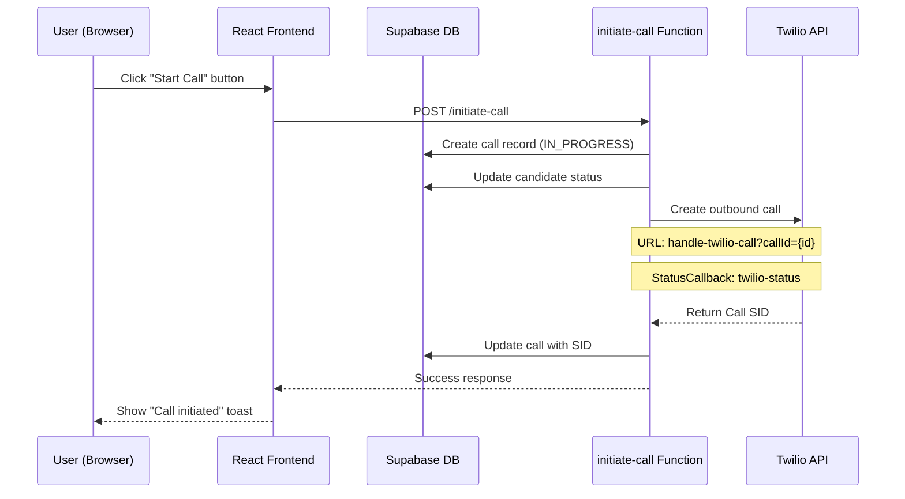
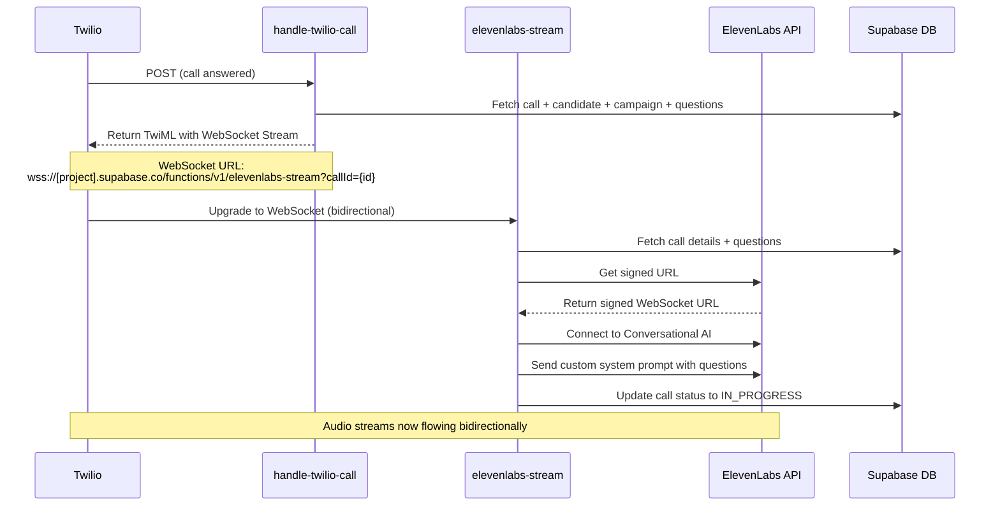
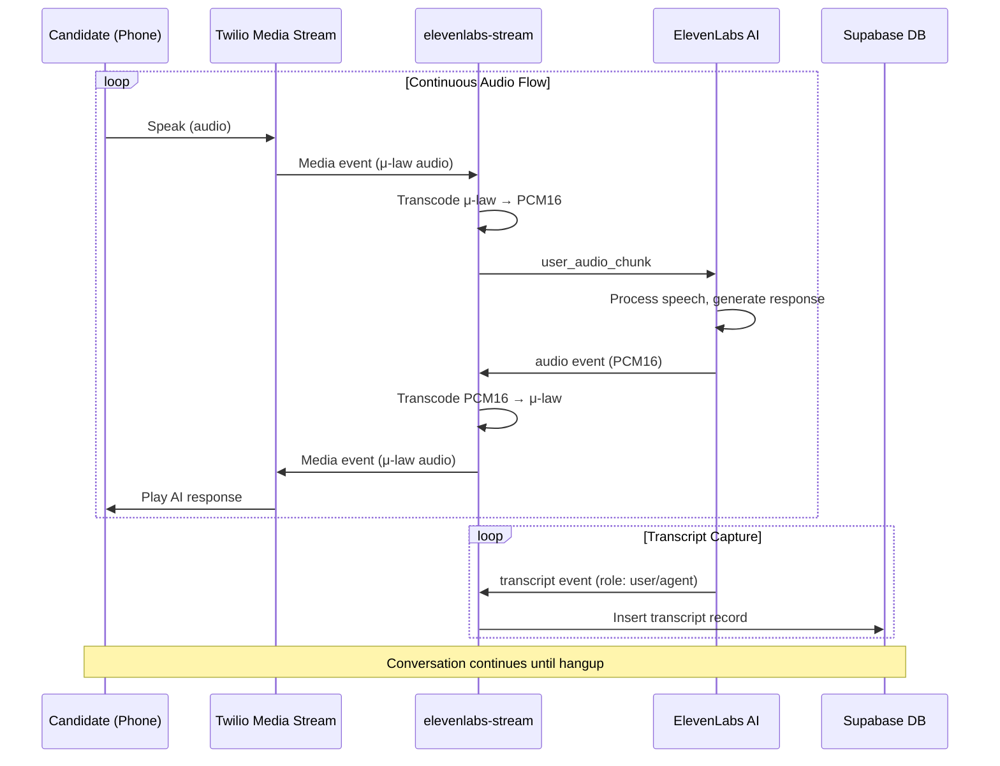
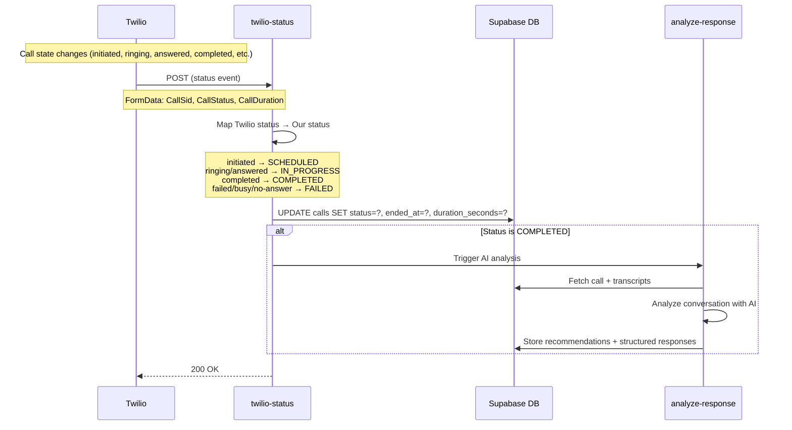
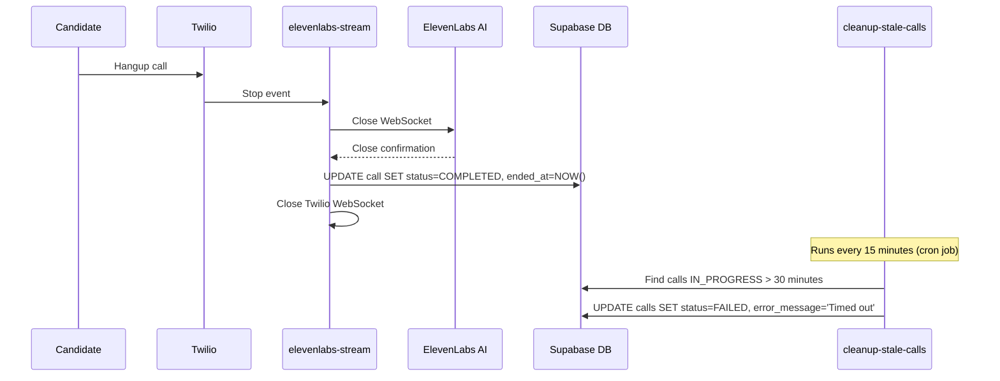
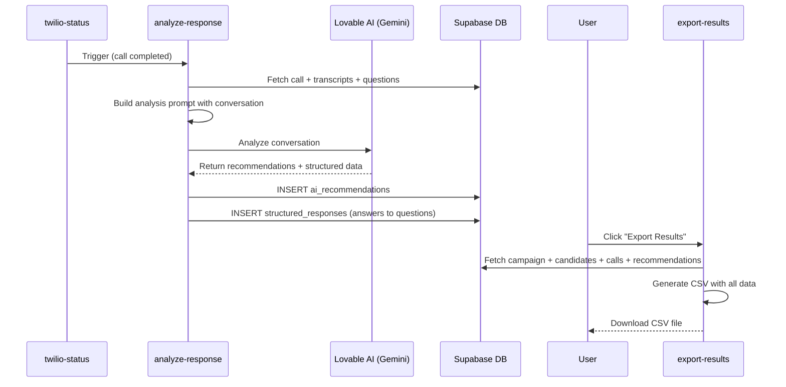
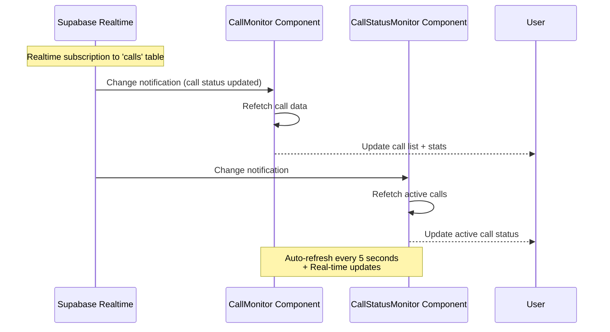

# Complete Call Flow - High-Level Design (HLD)

## System Architecture Overview

This document describes the complete end-to-end flow of the AI-powered calling system, from call initiation to AI analysis.

---

## 1. Call Initiation Flow



### Key Components:
- **initiate-call Function**: Creates call record, triggers Twilio
- **Twilio Configuration**: 
  - Voice URL: `handle-twilio-call`
  - Status Callback: `twilio-status`
  - Status Events: initiated, ringing, answered, completed, busy, no-answer, failed

---

## 2. Call Connection & WebSocket Setup



### Key Components:
- **handle-twilio-call**: Generates TwiML with WebSocket URL
- **elevenlabs-stream**: WebSocket relay between Twilio ↔ ElevenLabs
- **Audio Codecs**: 
  - Twilio uses μ-law (PCMU) at 8kHz
  - ElevenLabs uses PCM16 at 16kHz
  - Transcoding happens in real-time

---

## 3. Real-Time Conversation Flow



### Key Components:
- **Audio Transcoding**: Real-time conversion between formats
- **Transcript Storage**: Every utterance saved to `transcripts` table
- **Conversation ID**: Unique ElevenLabs conversation identifier

---

## 4. Call Status Updates via Webhook



### Key Components:
- **twilio-status Webhook**: Receives all call state changes
- **Status Mapping**: Twilio statuses → Application statuses
- **Auto-Trigger Analysis**: On call completion

---

## 5. Call End & Cleanup Flow



### Key Components:
- **Graceful Shutdown**: Both WebSockets close cleanly
- **Status Update**: Call marked as COMPLETED
- **Stale Call Cleanup**: Safety net for stuck calls (30min timeout)

---

## 6. AI Analysis & Data Export Flow



### Key Components:
- **analyze-response**: AI-powered conversation analysis
- **Lovable AI**: Uses Gemini 2.5 Flash for fast, accurate analysis
- **Structured Responses**: Extracts answers to campaign questions
- **CSV Export**: All data in one downloadable file

---

## 7. Real-Time UI Updates



### Key Components:
- **Supabase Realtime**: Postgres change notifications
- **React Query**: Auto-refetch with 5s interval
- **Call Statistics**: Total, In Progress, Completed, Failed

---

## Configuration & Environment

### Required Secrets (in Supabase):
- `TWILIO_ACCOUNT_SID`
- `TWILIO_AUTH_TOKEN`
- `TWILIO_PHONE_NUMBER`
- `ELEVENLABS_API_KEY`
- `ELEVENLABS_AGENT_ID`
- `LOVABLE_API_KEY`
- `SUPABASE_URL`
- `SUPABASE_SERVICE_ROLE_KEY`

### Edge Functions Configuration (`supabase/config.toml`):
```toml
[functions.handle-twilio-call]
verify_jwt = false  # Twilio webhooks

[functions.elevenlabs-stream]
verify_jwt = false  # WebSocket connection

[functions.twilio-status]
verify_jwt = false  # Twilio status webhooks

[functions.twilio-recording]
verify_jwt = false  # Twilio recording webhooks

[functions.initiate-call]
verify_jwt = true   # Authenticated user action

[functions.analyze-response]
verify_jwt = true   # Internal function

[functions.export-results]
verify_jwt = true   # Authenticated user action

[functions.cleanup-stale-calls]
verify_jwt = false  # Cron job
```

---

## Database Schema

### Key Tables:
- **calls**: Call records with status, duration, SID
- **candidates**: People to call
- **campaigns**: Campaign configuration
- **transcripts**: Real-time conversation capture
- **ai_recommendations**: AI-generated insights
- **structured_responses**: Extracted answers to questions
- **question_templates**: Question sets for campaigns
- **questions**: Individual questions

---

## Recent Fixes Applied

### 1. WebSocket URL Format
- **Issue**: Twilio couldn't connect to WebSocket
- **Fix**: Changed from `wss://kipvbsaroymehobtalsy.supabase.co/functions/v1/elevenlabs-stream` format to use project reference directly

### 2. Enhanced Logging
- **Added**: Comprehensive logging at every step
  - Request headers inspection
  - WebSocket upgrade details
  - Audio chunk counters
  - Error stack traces
  - Timestamp on all events

### 3. Error Handling
- **Added**: Proper TypeScript error typing
- **Added**: Detailed error messages with context
- **Added**: WebSocket upgrade failure handling

### 4. Status Webhook Logging
- **Added**: Full form data logging
- **Added**: Status mapping visibility
- **Added**: Update confirmation logs

---

## Testing Checklist

### 1. Test Call Initiation
✅ Call record created in DB
✅ Twilio receives request
✅ `handle-twilio-call` logs appear

### 2. Test WebSocket Connection
✅ `elevenlabs-stream` logs show upgrade
✅ ElevenLabs signed URL obtained
✅ WebSocket connection established

### 3. Test Audio Flow
✅ Audio chunks flowing Twilio → ElevenLabs
✅ Audio chunks flowing ElevenLabs → Twilio
✅ Transcripts being saved

### 4. Test Status Updates
✅ `twilio-status` receives webhooks
✅ Call status updates in DB
✅ Analysis triggers on completion

### 5. Test Cleanup
✅ Stale calls marked as FAILED after 30min
✅ Cleanup function runs on schedule

---

## Troubleshooting Guide

### No ElevenLabs Logs?
1. Check WebSocket URL format in `handle-twilio-call`
2. Verify `ELEVENLABS_API_KEY` and `ELEVENLABS_AGENT_ID` are set
3. Check if Twilio can reach your Supabase project (firewall?)

### No Status Webhook Logs?
1. Verify Twilio webhook URL: `https://[project].supabase.co/functions/v1/twilio-status`
2. Check `verify_jwt = false` in config.toml
3. Check Twilio dashboard for webhook errors

### Call Stuck IN_PROGRESS?
1. Check `twilio-status` webhook is configured
2. Verify cleanup function is running (every 15min)
3. Manually end stuck calls via SQL or cleanup function

### No Audio/Silent Call?
1. Check audio transcoding (μ-law ↔ PCM16)
2. Verify ElevenLabs agent is configured with voice
3. Check WebSocket message flow in logs

---

## Performance Metrics

- **Call Setup Time**: ~2-3 seconds
- **Audio Latency**: 200-400ms (Twilio + ElevenLabs)
- **Transcript Delay**: ~1-2 seconds behind audio
- **Analysis Time**: 5-15 seconds after call ends
- **Cleanup Interval**: Every 15 minutes
- **Stale Call Timeout**: 30 minutes

---

## Next Steps

1. ✅ Monitor first test call logs
2. ✅ Verify WebSocket connection establishes
3. ✅ Check status webhooks fire correctly
4. ✅ Confirm transcripts are saved
5. ✅ Test AI analysis on completed call
6. ✅ Test CSV export with data
